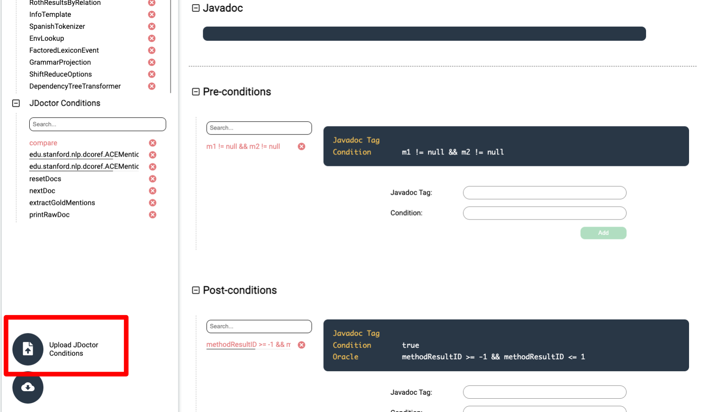
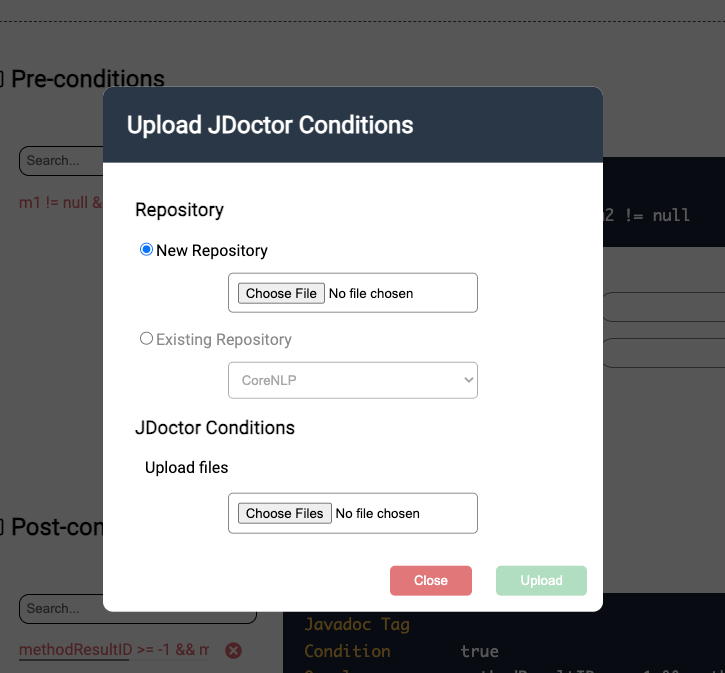

## Data Augmentation

#### Requirements
* Node.js
* npm
* sdkman

You can easily install both with [nvm](https://github.com/nvm-sh/nvm).
Install Node.js v16 (and npm v7) with:
```bash
nvm install 16
```
and then use it with:
```bash
nvm use 16
```

Install and initialize a local version of sdkman with:
```bash
bash generator/utils/init.sh 
```
The script will also install Java 8, 11, and 17, Maven 3.9.4, Ant 1.10.13, and Gradle 8.3.


### Client

Move to the `client` folder with:
```bash
cd client
```

#### Installation
Install the dependencies with:
```bash
npm install
```

#### Configuration
Create a `.env` file in the root directory of the project and add the following variables:
```bash
VITE_API_BASE_URL=[url of the API server]
VITE_PERMIT=[permit for the API server ("admin" or "student")]
```

#### Usage
Run the client with:
```bash
npm run dev
```
By deafult, the client will be available at `http://localhost:5173`.

### Server

Move to the `server` folder with:
```bash
cd server
```

#### Installation
Install the dependencies with:
```bash
npm install
```

#### Configuration
Create a `.env` file in the root directory of the project and add the following variables:
```bash
PORT=[port to listen on]
MONGODB_URI_CLOUD=[MongoDB Atlas URI]
PERMIT=[permit for the API server ("admin" or "student")]
CLIENT_URL=[url of the client]
```

#### Usage
Run the server with:
```bash
npm run dev
```

### Add repository to the platform

#### Generate the conditions

Execute the following command:
```bash
bash generate_repo_conditions.sh
```
The script will initially ask if you want to add a new repository (Y/N).
If you choose to add a new repository, you will be asked to provide the following information:
* Repository name (e.g. `tratto`)
* Repository URL (e.g. `https://github.com/AML14/tratto.git`)
* Commit hash (e.g. `cb4dcaefb661108455034942e312c269589504e3` or `last` by default)
* The relative path to the source code (e.g. `src/main/java`, or `src` by default)
* A list of fully qualified class names, separated by a blank space (e.g. `star.tratto.DataAugmentation star.tratto.OraclesAugmentation`, or `all` by default)
* The java version (e.g. `8`, `11`, and `17` supported. `8` by default).

The project will ask if you want to add another repository (Y/N). You can add how many repositories you want.
If you press `N`, the script will start to clone each project you listed (within the `src/resources/projects-source` folder) 
and will generate the conditions for each repository (within the `src/resources/data-entries` folder).
The final structure of the `src/resources/data-entries` folder will be:
```
data-entries
├── [project-name]
│   ├── [repository.json]
│   ├── [classes]
│   │   ├── [class-name].json
│   │   ├── [class-name].json
│   │   └── ...
├── [project-name]
│   ├── [repository.json]
│   ├── [classes]
│   │   ├── [class-name].json
│   │   ├── [class-name].json
│   │   └── ...
```

The `repository.json` file will contain the information about the repository, while each `[class-name].json` file will 
contain the conditions of the corresponding class.

#### Upload the repositories and the conditions to the platform
Access the platform with the `admin` permit (set the environment variable on the `.env` files of the client and the server) 
and go to the client web page (http://localhost:[client_port]). Click on the `Upload` button on the bottom right corner.



It will open a modal where you can upload the repositories and the conditions.



If you want to upload a new repository, select the `New Repository` option and upload the `repository.json` file of the repository.
If you want to update an existing repository, select the `Existing Repository` option and select the repository on the dropdown menu.
In the `Upload files` section, select the list of `classes` file of the repository to upload. Finally, click on the `Upload` button.

The uploading process can takes time depending on the number of classes and the number of conditions of each class.


