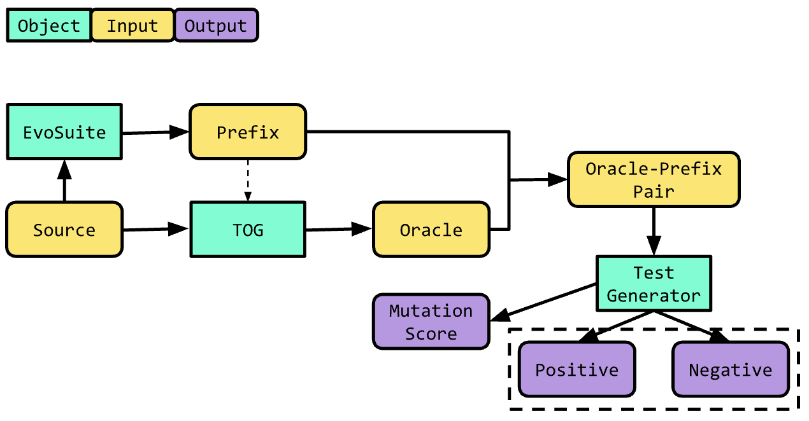

# Experiment

## Overview

This module automates the experimental analysis of a test-oracle generator (TOG) for the task of automated test generation. A unit test is composed of two parts: **the prefix** and **the oracle**. 

```agsl
// prefix
int a = 5;
int b = 1;
// oracle
assert sum(a, b) == (a + b)
```

To generate test prefixes, we use [EvoSuite](https://www.evosuite.org/), which generates complete unit tests (including the oracle), and remove the generated oracles (assertions). Then, we generate new oracles using an arbitrary TOG, and add these as assertions in the unit test. We provide a high-level diagram of this process below:



## Research Questions

As a qualifier, we define an "axiomatic" oracle, as a self-evident and unquestionable oracle (e.g. `methodResult != null`). Axiomatic oracles are very general and typically not specific to individual test prefixes. An example of a non-axiomatic oracle is: `sum(5, 1) == 6`.

In our experimental analysis, we seek to answer the following research questions:

1. What is the effectiveness (precision and recall) of `Tratto` for generating axiomatic oracles?
2. How does `Tratto` enhance test suites when combined with tools such as `EvoSuite` or `Randoop` in terms of precision, false-positives, and bug-finding ability?
3. Is `Tratto` able to recreate all (or more) axiomatic oracles generated by `JDoctor`? Is `Tratto` able to synthesize all oracles (and fix wrong oracles) generated by `TOGA`?

[comment]: <> (4. How does `Tratto` compare with `ChatGPT` for axiomatic oracle generation?)

## Metrics

To answer the above research questions, we perform two experiments: [Classification](#classification) (RQ 1, 3) and [Mutation](#mutation) (RQ 2).

### Classification

We say an oracle <span style="color:red">"fails"</span> the code if its corresponding test assertion fails using the current implementation. We say an oracle <span style="color:green">"passes"</span> the specification if the assertion *should* pass according to the specification.

|                     | Code                                  | Specification                         |
|---------------------|---------------------------------------|---------------------------------------|
| True Positive (TP)  | <span style="color:red">Fail</span>   | <span style="color:green">Pass</span> |
| False Positive (FP) | <span style="color:red">Fail</span>   | <span style="color:red">Fail</span>   |
| True Negative (TN)  | <span style="color:green">Pass</span> | <span style="color:green">Pass</span> |
| False Negative (FN) | <span style="color:green">Pass</span> | <span style="color:red">Fail</span>   |

For clarification, consider the following (buggy) code snippet:

```agsl
/**
 * @param a an integer
 * @param b an integer
 * @returns the sum of the two integer values
 */
public static int sum(int a, int b) {
    return a - b;
}
```

We provide an example of each class of oracle below:
- True Positive: `sum(a, b) == (a + b)`
- False Positive: `sum(a, b) == null`
- True Negative: `sum(a, b) != null`
- False Negative: `sum(a, b) == (a - b)`

Intuitively, we hope to maximize True Positives and True Negatives, and minimize False Positives and False Negatives. This corresponds to a high precision and a low FPR.

### Mutation

To analyze the "effectiveness" of the generated oracles, we compute the mutation score of the generated test suite. Consider the previous example, `sum`, and two corresponding oracles: `sum(a, b) == (a + b)` and `sum(a, b) != null`. We say the first assertion (1) is more "effective" than the second assertion (2). We quantify "effective"-ness via mutation score, which indicates how robust the test suite is to changes in source code. Intuitively, because (1) implies (2), we know that (1) will always kill more mutants than (2) and have a better mutation score.

## Implementation

We provide a brief description of the relevant classes within the `experiment` module.
- `analysis`: a package for executing analysis on a list of oracle-prefix pairs
  - `TestGenerator.java`: converts a list of oracle-prefix pairs into a test suite, classifies the generated oracles, and computes the mutation score
- `generators`: a package for generating oracles and prefixes
  - `oracle`: a sub-package for generating test oracles
    - `OracleGenerator.java`: provides an abstract outline of necessary functionality for TOG wrapper classes 
    - `JDoctor.java`: a TOG wrapper for JDoctor
    - `TOGA.java`: a TOG wrapper for TOGA
    - `Tratto.java`: a TOG wrapper for Tratto
  - `prefix`: a sub-package for generating test prefixes
    - `PrefixGenerator.java`: uses EvoSuite and provided source code to generate a list of text prefixes
- `util`: a package for shared utilities between packages
  - `IOUtils.java`: manages input processing for generation and output processing for analysis
