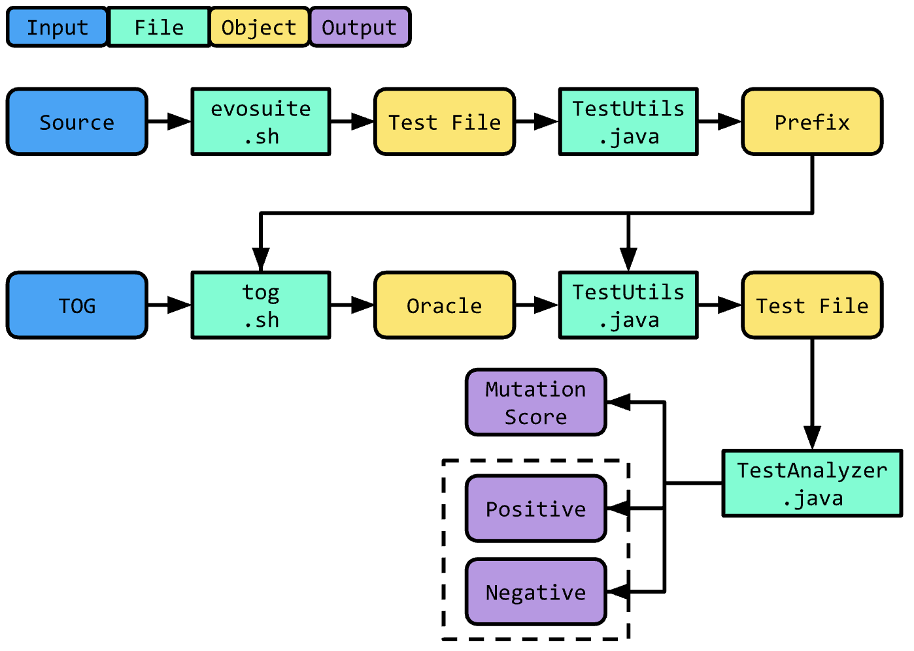

# Experiment

----

This module has all scripts necessary to reproduce the experimental results described in the paper "Tratto: A Neuro-Symbolic Approach to Deriving Axiomatic Test Oracles".

[//]: # (Add link to paper when available)

# 1. Setup

---

This section outlines all requirements and corresponding setup instructions for each tool used in the experimental pipeline. 
After the setup is complete, the user should be able to run each example command in the [Run the experiments](#3-run-the-experiments) section.

## 1.0. General Requirements

[Sdkman](https://sdkman.io/) is used to easily manage the multiple Java Development Kit(s) (JDKs) required by the different 
tools of the experimental pipeline. **Sdkman** is a Software Development Kit (SDK) manager.

First of all, check to have **zip** and **unzip** packages installed in your machine. Otherwise, check these webpage to install
them with the proper command ([zip](https://www.thegeekdiary.com/zip-command-not-found/) and [unzip](https://www.thegeekdiary.com/unzip-command-not-found/)).

Then, execute the command:

  ```shell
  bash ./generator/utils/init.sh
  ```

To download and install a local version of **Sdkman**. The script will also install a local version of:

* Java 8
* Java 17
* Maven 3.9.4
* Ant 1.10.13
* Gradle 8.3

## 1.1. Evosuite

### 1.1.1. Java 8

We use EvoSuite to generate test prefixes, which is written in Java 8. However, the experiment module uses Java 17. To run EvoSuite (and similarly, JDoctor), the user must configure a home directory for a local JDK 8 version. See [Oracle](https://www.oracle.com/java/technologies/downloads/#java8-linux) for JDK downloads (you may need an Oracle account to download older versions). Then, add the JDK to the `./generator/resources` directory. In `./generator/evosuite.sh`, modify the field at the top of the script, `JDK8_NAME`, to the name of the local JDK directory in `./generator/resources`. By default, the script searches for `jdk-1.8.jdk` (alternatively, you may rename your local JDK directory to match this name).

## 1.2. JDoctor

### 1.2.1. ToRaDoCu

To set up JDoctor for analysis, visit the [ToRaDoCu](https://github.com/albertogoffi/toradocu) GitHub page, and follow the setup
instructions to build the `toradocu-1.0-all.jar` file (may take a few minutes). Then, move the jar file to the `./generator/resources` directory.

### 1.2.2. Java 8

JDoctor is written in Java 8. Please complete the above [EvoSuite Java 8 setup](#111-java-8) instructions before continuing. Similar to the EvoSuite setup, modify the field at the top of the `./generator/jdoctor.sh` script, `JDK8_NAME`, to the name of the local JDK 8 directory in `./generator/resources`.

## 1.3. Toga

### 1.3.1. Git Large File Storage

Toga requires Git Large File Storage (Git LFS) to set up its environment. See the [Git LFS homepage](https://git-lfs.com/) for setup instructions.

### 1.3.2. Conda (recommended)

Toga is written in `Python 3.8` and requires the user to install various python packages (automated by `./generator/toga.sh` script). A package management system, such as conda, is recommended (but not required) to create an isolated environment to run the Toga experiments (and debug any potential errors). See the [Miniconda homepage](https://docs.conda.io/projects/miniconda/en/latest/) for setup instructions.

## 1.4. Tratto

### 1.4.1 Conda (recommended)

Similar to Toga, a package management system, such as conda, is recommended (but not required) to create an isolated environment to run the Tratto experiments (and debug any potential errors). See the [Miniconda homepage](https://docs.conda.io/projects/miniconda/en/latest/) for setup instructions. Otherwise, the setup is fully automated by `./generator/tratto.sh`.

## 1.5 Runner

### 1.5.1 Java 8

Please complete the above [EvoSuite Java 8 setup](#111-java-8) instructions before continuing. Similar to the EvoSuite and JDoctor setup, modify the field at the top of the `./runner.sh` script, `JDK8_NAME`, to the name of the local JDK 8 directory in `./generator/resources`.

### 1.5.1 Dependencies

The runner script requires the following dependencies to be installed in your machine:

```shell
sudo cpan DBD::CSV
````

## 1.6 Defects4J

To replicate the experiments with Defects4J, the Subversion command-line client tool must be installed.
Execute `svn --version` command to check if the tool is installed in your machine, otherwise check the list of commands
to install it in your machine, [here](https://command-not-found.com/svn).

# 2. Overview

----

This module automates the experimental analysis of a test oracle generator (TOG) for the task of automated test generation.
A unit test is composed of two parts: **the prefix** and **the oracle**.

```java
public class Example {
    public void exampleTest() {
        // prefix
        int a = 5;
        int b = 1;
        // oracle
        assertTrue(sum(a, b) == (a + b));
    }
}
```

To generate test prefixes, we use [EvoSuite](https://www.evosuite.org/), which generates complete unit tests (including
oracles), and remove the generated oracles (assertions) using [JavaParser](https://javaparser.org/).
Then, we generate new oracles using an arbitrary TOG, and add these assertions to the test prefixes. Finally, we run the tests using EvoSuite and record the number of passing/failing test cases, and report mutation score using [PITest](https://pitest.org/).


## 2.1 Experimental Pipeline

For reference, we provide a simplified graphic of the experimental pipeline:



and a brief description of the relevant files:

- `generator`: this package contains scripts for generating test prefixes and test oracles
  - `evosuite.sh`: a script that creates a test suite using EvoSuite for a given class
  - `jdoctor.sh`: a script that creates oracles using JDoctor
  - `toga.sh`: a script that creates oracles using TOGA
  - `tratto.sh`: a script that creates oracles using Tratto
- `src/main/java`: this directory contains all Java functionality for the end-to-end experimental pipeline
  - `data`: a package with records for representing input and output
  - `FileUtils.java`: a class with all necessary utilities to read, write, and move files
  - `TestUtils.java`: a class for test suite utilities, such as removing/inserting oracles
  - `Tog.java`: the main file for the `experiment.jar` build
  - `TogUtils.java`: a class for tog utilities, such as preprocessing input and postprocessing output
- `experiment.sh`: the end-to-end script which performs the experiment
- `runner.sh`: a script that compiles and runs a test suite

Note that in the previous diagram, the script `tog.sh` is a placeholder for the user-specified tog (e.g. `jdoctor.sh`, `toga.sh`, `tratto.sh`).


### 2.1.1. Prefix

We run `evosuite.sh` to generate a test suite using EvoSuite. These full test cases
include both the test prefix and the test oracle, and are saved in `experiment/output/evosuite-tests/`.
Then, we remove the oracles (assertions): for each oracle found within the original Evosuite tests, we generate
a dedicated test. Therefore, if an original Evosuite test has 4 oracles, we generate 4 corresponding tests, each of which
is dedicated to a specific oracle. This process does not impact the effectiveness of the test but simplify the
generation of the test prefixes and the re-insertion of the generated oracles.
After splitting all oracles from the original Evosuite tests, the generated tests are saved in
`experiment/output/evosuite-tests-simple/`, while the same tests without oracles (test prefixes) are saved in
`experiment/output/evosuite-prefix/`.


### 2.1.2. Oracle

We use the test prefixes to generate oracles using a specified TOG.
Each TOG has a corresponding script invoking the TOG (as a jar file or a python script).

After being generated, the new oracles are inserted as assertions in the test prefixes. Our method for inserting oracles
varies based on whether the TOG generates [axiomatic](#a-axiomatic) or [non-axiomatic](#b-non-axiomatic) oracles.

The new tests are saved as separate files in `experiment/output/tog-test/[tog]/`, where `[tog]` is the given TOG.

#### A. Axiomatic

If the oracles are axiomatic, then we insert the oracles wherever they are applicable. Consider the following oracles for the
aforementioned `sum` example method: `sum(a, b) != null` and `a != null`. We may interpret these oracles as "method
output must not be null" and "first method argument must not be null". Consequently, we should add the assertions after
every appearance of the method output or first method argument, respectively. Consider the following test prefixes
generated by EvoSuite.

```java
public class ExampleTest {
    void sumTest() {
        int a = 2;
        int b = 5;
    }

    void sumNegativeTest() {
        int a = -1;
        int b = 7;
    }
}
```

For axiomatic oracles, we use JavaParser to insert assertions wherever possible, yielding the following test suite,

```java
public class ExampleTest {
    void sumTest() {
        int a = 2;
        assert a != null;  // first method argument must not be null
        int b = 5;
        assert sum(a, b) != null;  // method output must not be null
    }

    void sumNegativeTest() {
        int a = -1;
        assert a != null;  // first method argument must not be null
        int b = 7;
        sum(a, b) != null;  // method output must not be null
    }
}
```

Consequently, each test case may have multiple oracles, and each oracle may be used more than once. Therefore, the number
of oracles may not equal the number of prefixes.

#### B. Non-Axiomatic

If the oracles are non-axiomatic, meaning they correspond to a test prefix, then we simply insert the oracle into its
corresponding test prefix. In contrast to the axiomatic oracles, each test case contains precisely one oracle, and each
oracle is used exactly once. Therefore, we will have an equal number of oracles and prefixes.


### 2.1.3 Output

We save the output as a JSON file. The output follows the format,

```json lines

{

  "tog": "tratto",

  "source": "path/to/source/File.java",

  "positive": 10,

  "negative": 24,

  "mutation-score": 85.42,

  "tests": [

    {

      "class": "File",

      "methodSignature": "sum(int a, int b)",

      "isPositive": false,

      "test": "int a = 2;\nassert a != null; ..."

    },

    ...,

    {

      "class": "File",

      "methodSignature": "sum(int a, int b)",

      "isPositive": false,

      "test": "int a = -1;\nassert != null; ..."

    }

  ]

}

```

We report the TOG, the source path, the number of failing tests (positive), the number of passing test (negative),
the mutation score, and information for each test case. For each test case, we report the class under test, the method
under test, whether the test passes or fails (`isPositive` is `true` if the test fails), and the test case as a String
(see `data.data.TestOutput.java` for further detail).


## 2.2. Research Questions

As a precursor, we define an "axiomatic" oracle, as a self-evident and unquestionable oracle (e.g. `methodResult != null`). Axiomatic oracles are very general and not specific to individual test prefixes. An example of a non-axiomatic oracle is `sum(5, 1) == 6`.

In our experimental analysis, we seek to answer the following research questions:

1. What is the effectiveness (precision and FPR) of Tratto for generating axiomatic oracles?
2. How does Tratto enhance test suites when combined with tools such as EvoSuite or Randoop in terms of bug-finding ability and mutation score?
3. Is Tratto able to recreate all (or more) axiomatic oracles generated by JDoctor? Is Tratto able to synthesize all oracles (and fix incorrect oracles) generated by TOGA?

[comment]: <> (4. How does Tratto compare with ChatGPT for axiomatic oracle generation?)


## 2.3. Metrics

To answer the above research questions, we perform two experiments: [Classification](#231-classification) (RQ 1, 3) and [Mutation](#232-mutation) (RQ 2).


### 2.3.1. Classification

We say an oracle <span style="color:red">"fails"</span> the code if its corresponding test assertion fails using the current implementation. We say an oracle <span style="color:green">"passes"</span> the specification if the assertion *should* pass according to the specification.

|                     | Code                                  | Specification                         |
|---------------------|---------------------------------------|---------------------------------------|
| True Positive (TP)  | <span style="color:red">Fail</span>   | <span style="color:green">Pass</span> |
| False Positive (FP) | <span style="color:red">Fail</span>   | <span style="color:red">Fail</span>   |
| True Negative (TN)  | <span style="color:green">Pass</span> | <span style="color:green">Pass</span> |
| False Negative (FN) | <span style="color:green">Pass</span> | <span style="color:red">Fail</span>   |

For clarification, consider the following (buggy) code snippet:

```java
public class Example {
    /**
     * @param a an integer
     * @param b an integer
     * @return the sum of the two integer values
     */
    int sum(int a, int b) {
        return a - b;
    }
}
```

We provide an example of each class of oracle below:
- True Positive: `sum(a, b) == (a + b)`
- False Positive: `sum(a, b) == null`
- True Negative: `sum(a, b) != null`
- False Negative: `sum(a, b) == (a - b)`

Intuitively, we hope to maximize True Positives and True Negatives, and minimize False Positives and False Negatives.
This corresponds to a high precision and a low FPR.


### 2.3.2. Mutation

To analyze the "effectiveness" of the generated oracles, we compute the mutation score of the generated test suite. Consider the previous example, `sum`, and two corresponding oracles: `sum(a, b) == (a + b)` and `sum(a, b) != null`. We say the first assertion (1) is more "effective" than the second assertion (2). We quantify "effective"-ness via mutation score, which indicates how robust the test suite is to changes in source code. Intuitively, because (1) implies (2), we know that (1) will always kill more mutants than (2) and have a better mutation score.

# 3. Run the experiments

----

First, check that all steps in [Section 1.1](#1-setup) have been complete. Then, to perform an experiment, run the command:

  ```shell
  bash experiment.sh [tog_name] [fully_qualified_class_name] [source_path] [binary_path] {[jar_path]}
  ```

providing four arguments as input:
1. the TOG name [`jdoctor`,`tratto`,`toga`]
2. the fully qualified name of the class under test
3. the absolute path to the source of the project
4. the absolute path to the binary classes of the project
5. the absolute path to the jar file of the project (only for `tratto`)

We provide a toy example of a project composed of a single class which represents the implementation of a stack (`Stack.java`).
The java project is collocated under the path `experiment/src/test/resources/project`.

We provide an example on how to generate test oracles with each of the TOG, for the given project. The commands are
generalizable to any class of a given java project.

## 3.1. JDoctor

Run:

```shell
bash experiment.sh jdoctor tutorial.Stack [path_to_experiment]/src/test/resources/project/src/main/java [path_to_experiment]/src/test/resources/project/target/classes
```

substituting the `[path_to_experiment]` with the absolute path to the `experiment` root folder.

## 3.2. Toga

Run:

```shell
bash experiment.sh toga tutorial.Stack [path_to_experiment]/src/test/resources/project/src/main/java [path_to_experiment]/src/test/resources/project/target/classes
```

substituting the `[path_to_experiment]` with the absolute path to the `experiment` root folder.

## 3.3. Tratto

Move to the Stack project folder from the root directory (`experiment`):

```shell
cd src/test/resources/project
```

Generate the jar of the project with `Maven`:

```shell
mvn clean package
```

Run:

```shell
bash experiment.sh tratto tutorial.Stack [path_to_experiment]/src/test/resources/project/src/main/java [path_to_experiment]/src/test/resources/project/target/classes [path_to_experiment]/src/test/resources/project/target/[project_jar_name].jar
```

substituting the `[path_to_experiment]` with the absolute path to the `experiment` root folder, and `[project_jar_name]` with the name of the jar generated by Maven.
